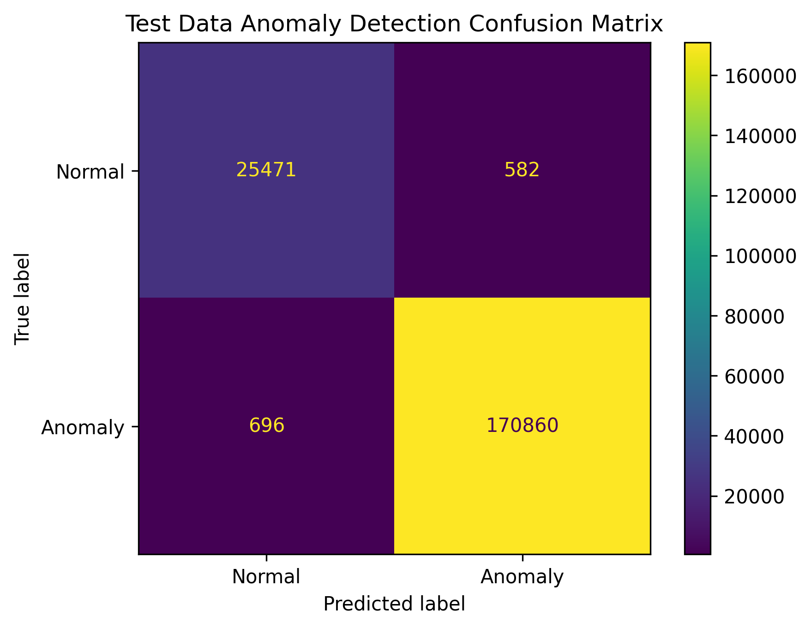

# TCP Anomaly Detection Server

This project contains an asynchronous TCP server for detecting anomalous network traffic using a pre-trained Isolation Forest model.

This is designed to be a service running in a terminal. Data is batched and converted to JSON format. At periodic time intervals, these batches are passed to the server to detect any nefarious network activity.

The server runs the data through the machine learning pipeline and triggers alarms if any instance is identified as anomalous.

This repository also contains the code used to train the model.

## How it works

The server waits for a client to connect and then reads JSON records. These records are converted into a pandas DataFrame and reduced to the features expected by the model. These features were found to be the most predictive during exploratory analysis.

The ML pipeline then handles the preprocessing and anomaly detection. Isolation Forest returns `1` for normal traffic and `-1` for anomalous traffic. The server converts this into a simple JSON response.

In general, the data flows through the server as:

```text
Client
  |
  | JSON record
  v
TCP Server
  |
  | Feature selection
  v
ML Pipeline
  |
  | Isolation Forest
  v
Anomaly result
  |
  v
Client
```

## Requirements

The server requires Python 3.8+ and the following packages:

```bash
pip install joblib numpy pandas scikit-learn
```

`asyncio` is included with Python.

## Model files

Two files are required in the same directory as the server:

```text
inferencePipeline.pkl
predictive_features.pkl
```

`inferencePipeline.pkl` contains the trained preprocessing and Isolation Forest pipeline.

`predictive_features.pkl` contains the list of features that the model expects. Keeping this list separate means the server can ensure incoming records contain the same features that were used when training the model.

The feature list contains:

```python
[
    "service",
    "flag",
    "dst_bytes",
    "logged_in",
    "count",
    "srv_count",
    "dst_host_count",
    "dst_host_srv_diff_host_rate"
]
```

## Running the server

The server takes the IP address and port as command-line arguments:

```bash
python server.py <ip> <port>
```

For example:

```bash
python server.py 127.0.0.1 5000
```

You should then see:

```text
TCP server listening on 127.0.0.1:5000
```

To listen on all network interfaces:

```bash
python server.py 0.0.0.0 5000
```

### Expected input

The expected input from the client is:

```json
{
    "1696752001": {
        "service": 22,
        "flag": 9,
        "dst_bytes": 5450,
        "logged_in": 1,
        "count": 9,
        "srv_count": 9,
        "dst_host_count": 9,
        "dst_host_srv_diff_host_rate": 0.0
    },
    "1696752002": {
        "service": 22,
        "flag": 9,
        "dst_bytes": 486,
        "logged_in": 1,
        "count": 19,
        "srv_count": 19,
        "dst_host_count": 19,
        "dst_host_srv_diff_host_rate": 0.0
    }
}
```

The server ignores the time key because it is not meaningful for the model. We only care about whether there is an anomaly in the data, not the exact time it occurred.

### Response

For example:

```json
{
    "anomaly": true
}
```

The client application interfacing with this server can then trigger alarms.

If something goes wrong while processing a record, an error is returned instead:

```json
{"error":"error description"}
```

## Training the model

The model is trained separately from the server. Once training is complete, the fitted pipeline is saved using `joblib`.

The notebook performs the following steps:

1. **Collects the KDD Cup 1999 dataset.** The KDD dataset is a well-known network intrusion detection dataset containing examples of both normal and malicious network activity. This makes it suitable for training the model.

2. **Cleans and prepares the data.** The data is cleaned and converted into the required numerical format. Categorical features are encoded and numerical features are scaled. This is important because the model requires a consistent numerical representation of the input data. One-hot encoding is not used for categorical features because it unnecessarily increases the number of dimensions, which increases computational requirements and can require more estimators.

3. **Performs feature engineering.** A Random Forest is used to identify features that are more predictive of anomalous behaviour. Less useful features are removed so that the anomaly detection model is less influenced by noisy or weakly informative features. A Random Forest is useful for feature selection because it can capture non-linear relationships and interactions between features.

4. **Splits the data into training, validation and test sets.** The dataset is divided into 60% training data, 20% validation data and 20% test data. Anomalous samples are removed from the training data so that the Isolation Forest learns the characteristics of normal network behaviour. Otherwise, the training data could become saturated with outliers, causing the model to incorporate anomalous behaviour into the baseline distribution.

5. **Trains and tunes the model.** An Isolation Forest is trained using the normal training data, with outliers removed. Hyperparameters are tuned using grid search, with model performance evaluated primarily using recall. Recall is prioritised because the objective is to identify as many anomalous network events as possible.

6. **Trains the final model and constructs the inference pipeline.** The optimal hyperparameter configuration is used to train the final model. The preprocessing steps and model are then combined into a single pipeline that accepts raw network data and produces an anomaly prediction. The pipeline and selected feature list are saved for use by the server application.

7. **Evaluates the final model.** The final model is evaluated using the held-out test data. Accuracy, precision, recall and F1 score are calculated, along with a confusion matrix to provide a more detailed view of the model's performance.



### Key performance metrics

- **Accuracy:** 0.9935
- **Precision:** 0.9966
- **Recall:** 0.9959
- **F1 score:** 0.9963

## Project structure

A typical directory looks like this:

```text
.
├── server.py
├── inferencePipeline.pkl
├── predictive_features.pkl
├── images/
│   └── confusion_matrix.png
└── README.md
```